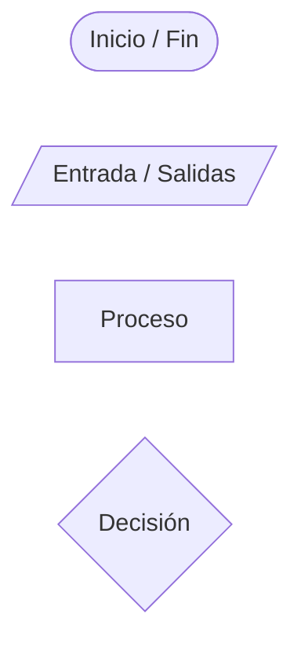
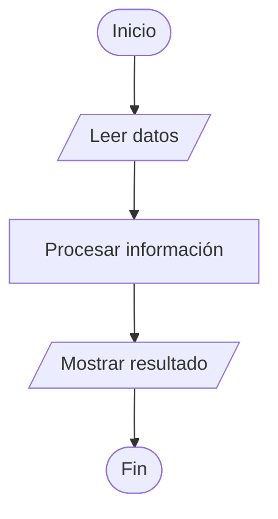

# Plantilla de Diagrama de Flujo

Utiliza esta plantilla como base para representar algoritmos.

---

## 📌 Convención de símbolos



### Significado

- **([ ])** → Inicio / Fin  
- **[/ /]** → Entrada o salida de datos  
- **[ ]** → Proceso (cálculos, asignaciones)  
- **{ }** → Decisión (condición)

---

## 🧱 Plantilla básica (secuencial)



---

## 🧪 Ejemplo práctico

**Problema:** Calcular el promedio de 3 números.

```mermaid
flowchart TD
    A([Inicio]) --> B[/Leer n1, n2, n3/]
    B --> C[promedio = (n1+n2+n3)/3]
    C --> D[/Mostrar promedio/]
    D --> E([Fin])
```

---

## 🧠 Recomendaciones

✔ Usa nombres claros en cada proceso  
✔ Evita escribir “Procesar” sin especificar la acción  
✔ Mantén el flujo vertical (de arriba hacia abajo)  
✔ Usa decisiones solo cuando exista una condición  
✔ Verifica que todas las flechas tengan dirección lógica  

---

## ❗ Errores comunes

✘ Saltar pasos del proceso  
✘ No indicar qué datos se leen  
✘ No indicar qué resultado se muestra  
✘ Usar decisiones cuando no son necesarias  

---

## 🎯 Recuerda

Un diagrama debe permitir entender la solución **sin leer el código**.

